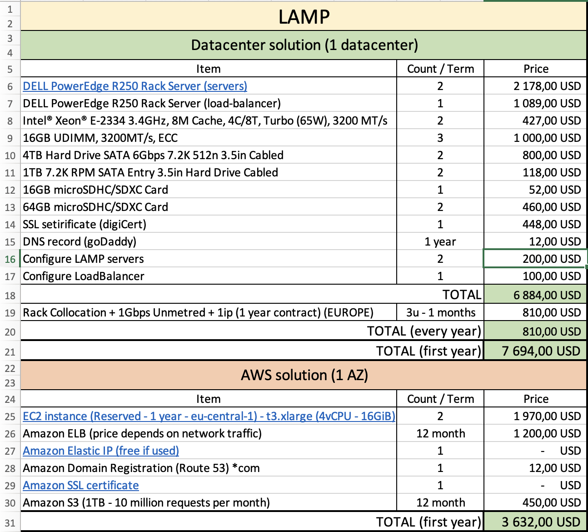

# Homework #1

## Task:
- Using open data and own knowledge, prepare a list of resources required to run a typical website (LAMP/LEMP) in a private datacenter for one year.
- Include approximate pricing for the resources
- Try to think about non-direct requirements and include them in estimate
- Storage backups
- Power devices
- Reserved network paths
- Maintenance schedule
- Commit resulting spreadsheet to your repository
- Extra points: do the same using AWS or Azure pricing calculator and compare the price

## Solution:

The solutions proposed include on-premise one with rack collocation and other one using AWS resources

My calculations:

