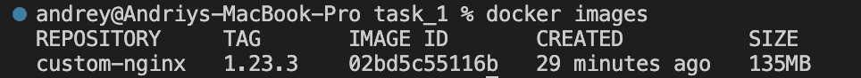
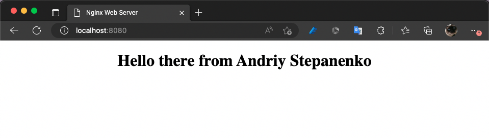
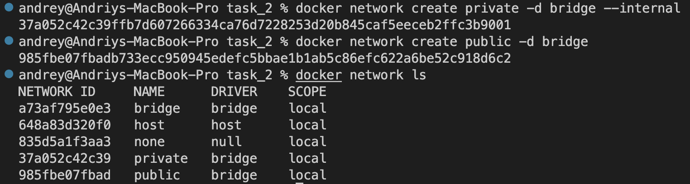
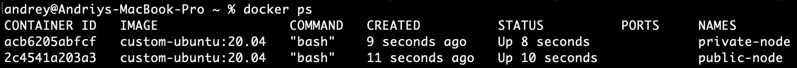
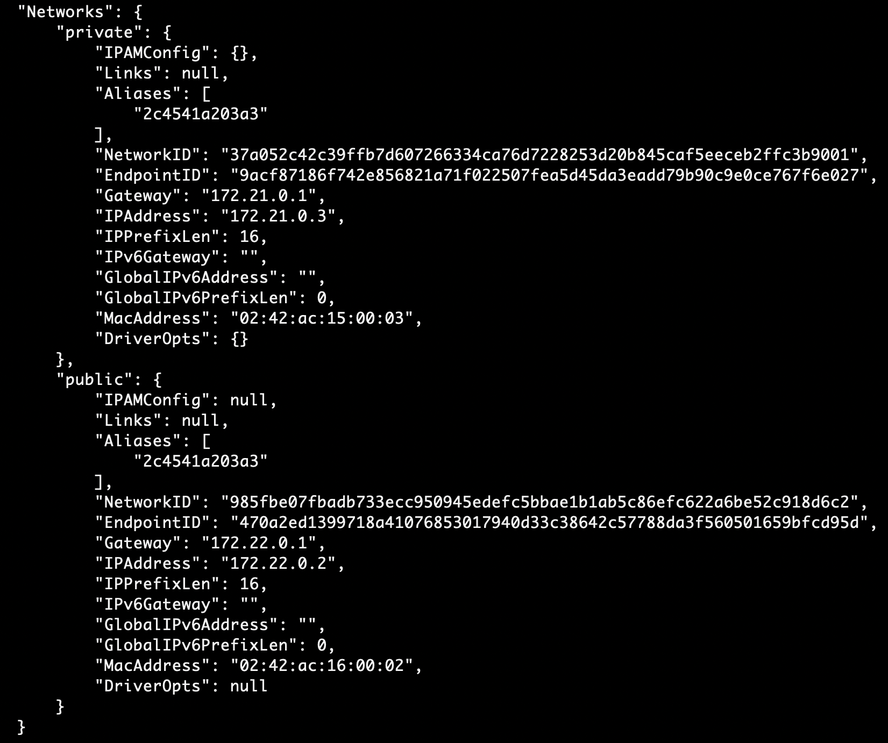
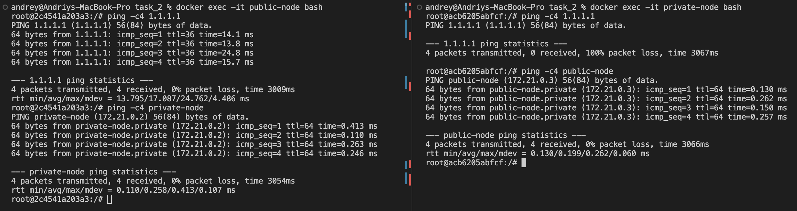

# Homework #10 - Docker

## Task 1:
1. Install docker
2. Prepare a dockerfile based on Apache or Nginx image
3. Added your own index.html page with your name and surname to the docker image
4. Run the docker container at port 8080
5. Open page in Web Browser
6. Report save in GitHub repository

## Task 2:
1. Prepare private and public network
2. Prepare one dockerfile based on ubuntu with the ping command
3. One container must have access to the private and public networks the second container
must be in the private network
4. A) Run a container that has access to the public network and ping some resources (example: google.com)\
    B) The second container ping the first container via a private network
5. Report save in GitHub repository


## Solution

### Task 1

Custom nginx image:


To use image run the following command:
```
$ docker run --name=nginx -d -p 8080:80 --image custom-nginx:1.23.3
```

Custom web page:


### Task 2

Private and public networks created:



Run two containers (one within `private` and the other one - within `public` network)

```
docker run -d -t --rm --network public --name public-node custom-ubuntu:20.04
docker run -d -t --rm --network private --name private-node custom-ubuntu:20.04
```


Connect `public-node` to `private` network

```
docker network connect private public-node
```



We are ready to ping :)


