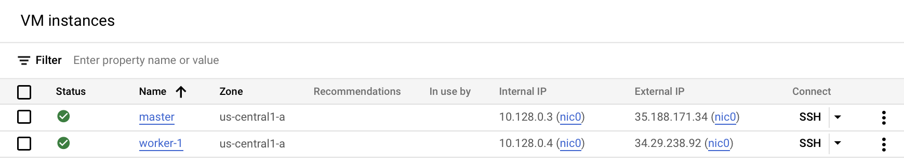
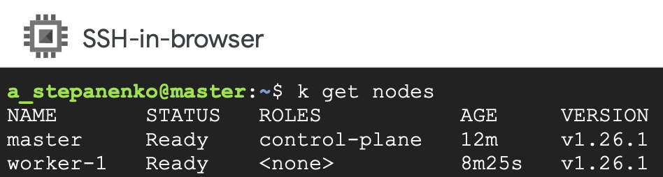

# Homework #11 - k8s cluster setup

## Task 1:
1. Prepare 2 VMs (kubemaster and kubenode) with the same parametrs
```
Requirements:
4 CPU
8 GB RAM
Ubuntu
Disk size: 25 GiB
```
2. Deploy k8s cluster with kubemaster

## Solution

### 1. Provision VMs:


### 2. Connect to master and make preliminary configurations (on both VMs):

1. Add both hostnames to /etc/hosts
2. Install dependencies and kube binaries
```
sudo apt install curl apt-transport-https -y
curl -s https://packages.cloud.google.com/apt/doc/apt-key.gpg | sudo apt-key add -
sudo apt update
sudo apt -y install vim git curl wget kubelet kubeadm kubectl
sudo apt-mark hold kubelet kubeadm kubectl
```
3. Disable swap and verify
```
sudo swapoff -a
sudo cat /proc/swaps
```
4. Enable Kernel Modules and Change Settings in sysctl:
```
sudo modprobe overlay
sudo modprobe br_netfilter
```
5. Add following lines to `/etc/sysctl.d/kubernetes.conf`
```
net.bridge.bridge-nf-call-ip6tables = 1
net.bridge.bridge-nf-call-iptables = 1
net.ipv4.ip_forward = 1
```
6. Reload sysctl
```
sudo sysctl --system
```
7. Install runtime `containerd`
```
sudo apt install gnupg2 software-properties-common ca-certificates -y
curl -fsSL https://download.docker.com/linux/ubuntu/gpg | sudo apt-key add -
sudo add-apt-repository "deb [arch=amd64] https://download.docker.com/linux/ubuntu $(lsb_release -cs) stable"
sudo apt update
sudo apt install containerd.io -y
```
8. Configure runtime and reload
```
sudo su
mkdir -p /etc/containerd
containerd config default>/etc/containerd/config.toml
systemctl restart containerd && systemctl enable containerd
exit
```

### 3. Setup k8s cluster and install network plugin

### On master node

1. Initialize master node with kubeadm and specify pod network
```
sudo kubeadm init --pod-network-cidr=192.168.0.0/16
```

2. Create config file
```
mkdir -p $HOME/.kube
sudo cp -f /etc/kubernetes/admin.conf $HOME/.kube/config
sudo chown $(id -u):$(id -g) $HOME/.kube/config
```

3. Install network plugin (`tigera-operator`)
```
kubectl create -f https://raw.githubusercontent.com/projectcalico/calico/v3.25.0/manifests/tigera-operator.yaml
curl https://raw.githubusercontent.com/projectcalico/calico/v3.25.0/manifests/custom-resources.yaml -O
kubectl create -f custom-resources.yaml
```


### On worker node

1.  Connect worker node to cluster
```
kubeadm join 10.132.0.9:6443 --token ut36yh.qd0aeqwaciay05l6         --discovery-token-ca-cert-hash sha256:<unique_value>
```

### 3. k8s cluster is ready


