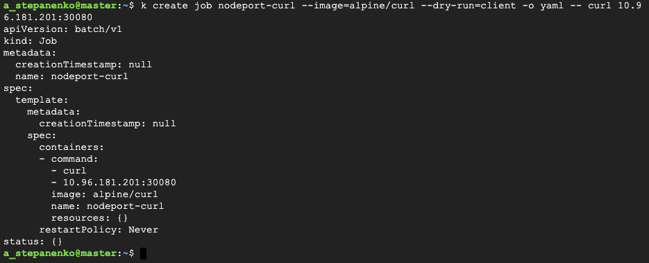

# Homework #12 - k8s part 1

## Task 1:
1. Get information about your worker node and save it in some file
2. Create a new namespace (all resources below will create in this namespace)
3. Prepare `deployment.yaml` file which will create a Deployment with `3` pods of `Nginx` or `Apache` and service for access to these pods via `ClusterIP` and `NodePort`.
    - Show the status of deployment, pods and services. Describe all resources which you will create and logs from pods
4. Prepare two job yaml files:
    - One gets content via curl from an internal port (ClusterIP)
    - Second, get content via curl from an external port (NodePort)
5. Prepare `Cronjob.yaml` file which will test the connection to Nginx or Apache service every `3 minutes`.

## Solution

### 1. Get information about your worker node and save it in some file
```
k describe node worker-1 > worker.txt
```


### 2. Create a new namespace (all resources below will create in this namespace)

Create a new namespace and switch current context to it:
```
k create ns web
k config set-context --current --namespace=web
```


### 3. Prepare `deployment.yaml` file which will create a Deployment with `3` pods of `Nginx` or `Apache` and service for access to these pods via `ClusterIP` and `NodePort`

Use imperative approach to generate template:
```
k create deploy web-app --image=nginx:1.23.3-alpine-slim --replicas=3 --port=80 --dry-run=client -o yaml > web-app.yaml
```


Now we can add services for exposing `web-app` deployment. Easiest way is to use imperative approach
```
k expose deploy web-app --name=web-svc --type=NodePort --port=8080 --target-port=80 --dry-run=client -o yaml
```


Finally we have the following `deployment.yaml` manifest:
```yaml
apiVersion: apps/v1
kind: Deployment
metadata:
  labels:
    app: web-app
  name: web-app
spec:
  replicas: 3
  selector:
    matchLabels:
      app: web-app
  template:
    metadata:
      labels:
        app: web-app
    spec:
      containers:
      - image: nginx:1.23.3-alpine-slim
        name: nginx
        ports:
        - containerPort: 80
---
apiVersion: v1
kind: Service
metadata:
  labels:
    app: web-app
  name: web-svc
spec:
  ports:
  - port: 8080
    protocol: TCP
    targetPort: 80
    nodePort: 30080
  selector:
    app: web-app
  type: NodePort
```

Which we can apply:
```
k apply -f deployment.yaml
```


### 4. Prepare two job yaml files

Once again, the easieast way is to generate them with kubectl
```
k create job cluster-curl --image=alpine/curl --dry-run=client -o yaml -- curl web-svc:8080
```


```
k create job nodeport-curl --image=alpine/curl --dry-run=client -o yaml -- curl 10.96.181.201:30080
```



### 5. Prepare `Cronjob.yaml` file which will test the connection to Nginx or Apache service every `3 minutes`

Contents of `Cronjob.yaml`:
```yaml
apiVersion: batch/v1
kind: CronJob
metadata:
  name: web-check
spec:
  schedule: "*/3 * * * *"
  jobTemplate:
    spec:
      template:
        spec:
          containers:
          - name: web-check
            image: curlimages/curl:7.87.0
            args: [ "web-svc:8080" ]
          restartPolicy: OnFailure
```

Result:

