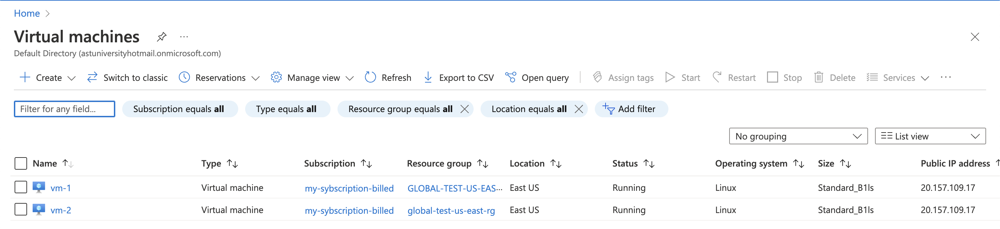
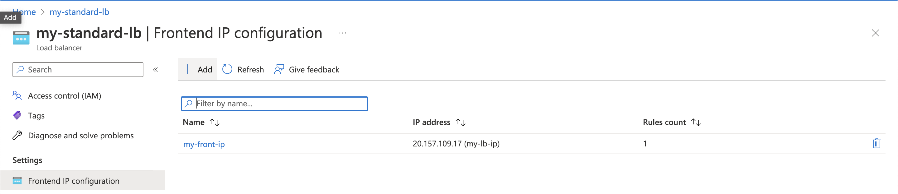
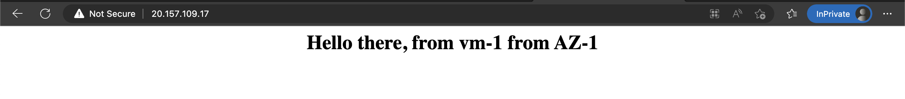
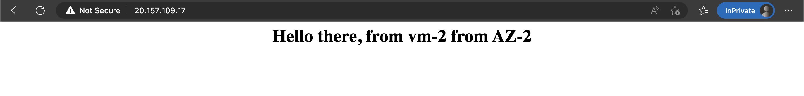

# Homework #2

## Task:
1. Get test account on Azure
2. Create 2 Linux VMs with webserver (apache or nginx) installed
3. Configure loadbalancer to serve data from these VMs
4. Export resulting infrastructure as an ARM template and commit to your repository.
5. Extra points: Web-server installation should be handled by template

## Solution:

### Task 2

Linux VMs with LB attached



### Task 3

LB frontend config



LB backend config


Webpage from VM-1 in Zone-1



Webpage from VM-2 in Zone-2



### Task 4

See the template folder `ExportedTemplate-global-test-us-east-rg`

***
### Extra Task:

I've used [User Data](https://learn.microsoft.com/en-us/azure/virtual-machines/user-data) option to run custom script (see `user_data` script)
```
#!/bin/sh
apt-get update -y
apt install nginx -y
apt install jq -y
systemctl start nginx
systemctl enable nginx
VM_NAME="$(curl -s -H Metadata:true --noproxy "*" "http://169.254.169.254/metadata/instance?api-version=2021-02-01" | jq '.compute.name' -r)"
ZONE="$(curl -s -H Metadata:true --noproxy "*" "http://169.254.169.254/metadata/instance?api-version=2021-02-01" | jq '.compute.zone' -r)"
echo "<h1><center>Hello there, from ${VM_NAME} from AZ-${ZONE}</center></h1>" > /var/www/html/index.html
```