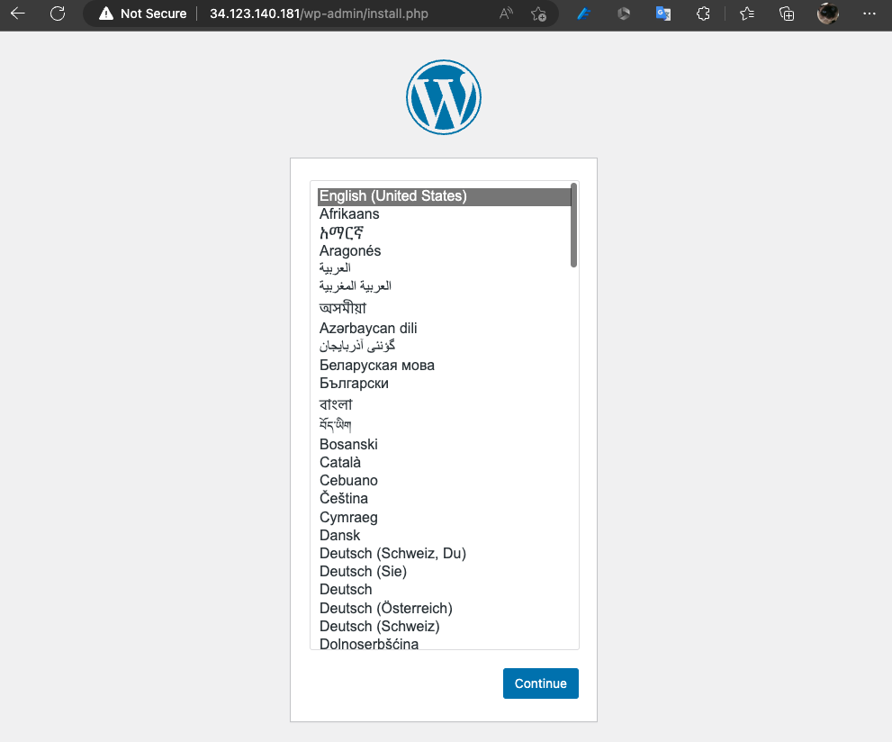
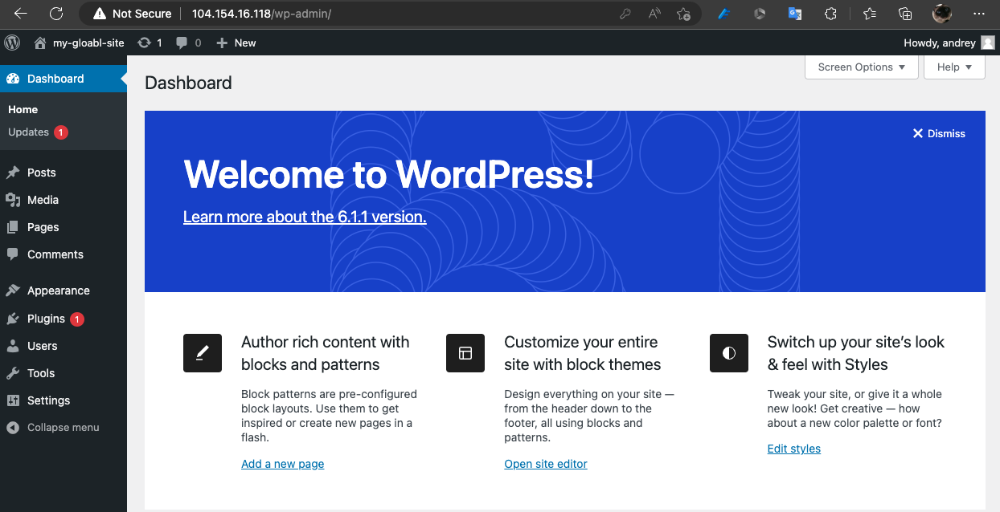

# Homework #3 - GCP

## Task:
1. Create an GCP account
2. Deploy a VM (web) with an Nginx server with Wordpress on top of it
3. Deploy a VM (db) with a MySQL db
4. Deploy instances using terraform and metadata option
5. Ensure the web-vm runs a db connection via internal ip of the db-vm

## Solution:

**To run this project locally need to change the following parameters:**
- **./provider.tf** -> *credentials* (json file with GCP SA keys)
- **./provider.tf** -> *project* and *region* tf_vars

### Network & firewall rules

* Deployed a VPC with a subnet of the specific range (`192.168.1.0/24`).
* Three firewalls rules deployed:\
    1) `ssh` rule for both VMs
    2) `web` rule to allow external HTTP connections
    3) `db` rule to allow connection to mysql-db on port `3306` from `192.168.1.0/24` source range

### db-vm

* Deployed an `e2-micro` vm using `ubuntu-2004-lts` version (fetched from `data` block)
* Set internal IP to `192.168.1.2` (can be changed via tf-vars, *HOWEVER* `web_bootstrap` script depends on this address)
* Metadata startup-script `db-bootstrap.sh` install and configures `mariadb` server to serve Wordpress `web-vm` requests

### web-vm
* Deployed an `e2-micro` vm using `ubuntu-2004-lts` version (fetched from `data` block)
* Set internal IP to `192.168.1.3` (can be changed via tf-vars)
* Metadata startup-script `web-bootstrap.sh` install and configures `nginx` server and the `Wordpress` app

### Landing page

On accessing web-vm external-ip

After configuration:

