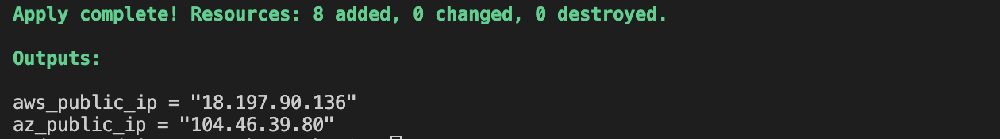

# Homework #6 - Terraform

## Task:
1. Create two terraform modules for provisioning one AWS and one Azure instance;
2. Use variables.
3. Provision one SSH public key for created instances;
4. Make your instances available to everyone on the web;
5. Add public IP of instances to Output Values;
6. Install Grafana to your instances;
7. Create a beautiful repository structure and clear readme file with information about your project like for your grandma.
8. Add terraform apply output to the last section of your readme like in example:
```
Apply complete! Resources: * added, * changed, * destroyed.
Outputs:
xx
yy
```

## Solution:

### Project Structure
```
└── hw_6
    ├── aws
    │    ├── main.tf
    │    ├── vars.tf
    │    └── outputs.tf
    ├── azure
    │    ├── main.tf
    │    ├── vars.tf
    │    └── outputs.tf
    ├── data
    │    ├── grafana.sh
    │    └── public-key.pub
    ├── main.tf
    ├── providers.tf
    ├── outputs.tf
    └── README.md
```

### How to run?

Pass environmnet variables to authenticate:

**AWS**
```
export AWS_ACCESS_KEY_ID="<aws_access_key_id>"
export AWS_SECRET_ACCESS_KEY="<aws_secret_access_key>"
```
**Azure**
```
export ARM_SUBSCRIPTION_ID="<azure_subscription_id>"
export ARM_TENANT_ID="<azure_subscription_tenant_id>"
export ARM_CLIENT_ID="<service_principal_appid>"
export ARM_CLIENT_SECRET="<service_principal_password>"
```

Navigate to root dir `hw_6` and run the following commands:
```
$ terraform init
$ terraform plan
$ terraform apply --auto-approve
```

Eventually this will produce the following output (the IPs will differ):
```
Apply complete! Resources: 9 added, 0 changed, * destroyed.

Outputs:

aws_public_ip = "35.158.116.210"
az_public_ip = "35.158.116.210"
```



### What was created?

The project includes two modules (namely `aws` and `azure`) where each include a VM with the preinstalled `grafana`. 

Each VM is placed inside a seperate subnet within a network (VPC) with the appropriate firewall rules (port `22` for `ssh` and port `3000` for `grafana`) and a public IP attached.

Grafana server is installed on each VM using `user-data` section. See the `./data/grafana.sh` script.

### What can be configured?

#### AWS

Inside `aws` module the following vars are present:
- `ec2_type` - VM type (default = `t2.micro`) 
- `ec2_count` - number of VMs (default = `1`)
- `public_key` - location to the ssh key which will be propagated to the VM
- `tags` - map of tags propagated to each resource

#### Azure

Inside `azure` module the following vars are present:
- `rg_name` - Resource Group (default = `global-rg`)
- `rg_location` - Region to deploy reource (default = `westeurope`)
- `vm_type` - VM type (default = `Standard_B1ls`)
- `public_key` - location to the ssh key which will be propagated to the VM
- `tags` - map of tags propagated to each resource

### How to clean resources?

Run the following command to clean up
```
terraform destroy --auto-approve
```

On accessing web-vm external-ip


After configuration:


