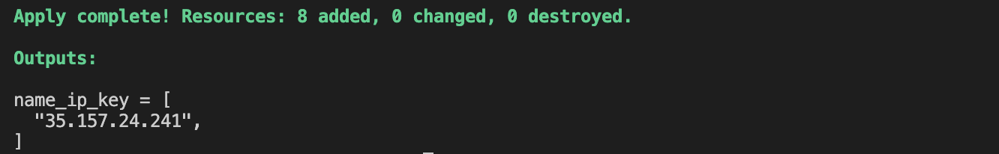
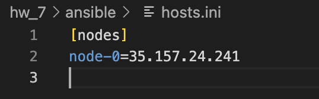
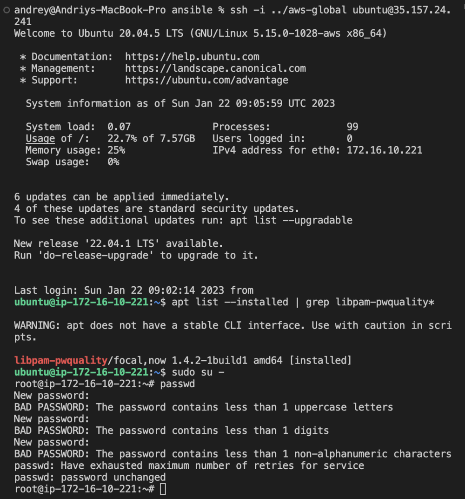

# Homework #7 - Hardening

## Task:
1. Create and run a script (Ansible playbook) to harden users’ passwords by rejecting the ones that contain a username. Enforce this rule for ‘root’ as well.
2. [Optional] Try to implement the same hardening rule without PAM.
3. Write a report in Google Doc providing the playbook’s code and proof of workability (screenshots or asciicinema recording)

* Target platform: any Linux-based distribution
* Tools 
    1. Ansible
    2. Utilize PAM authentication module


## Solution

### Project Structure
```
└── hw_7
    ├── terraform
    │    ├── providers.tf
    │    ├── main.tf
    │    ├── vars.tf
    │    └── outputs.tf
    ├── ansible
    │    ├── hosts.ini (# generated by Terraform)
    │    ├── inventory.tmpl
    │    └── harden.yaml
    └── README.md
```

### Description

Once run, the project provisions Ubuntu VMs (the number of VMS can be configured) in the `AWS Cloud` along with other cloud resources (vps, subnet, routing table, etc.) required for VMs to properly function. 

After resource provisiong is completed the Ansible playbook `./ansible/harden.yaml` is run localy (local-exec provisioner in `./terraform/main.tf`) to install and configure `libpam-pwquality` package to harden users authentication. 

The playbook enforces the following rules:

>* A minimum password length of 12 chars
>* One lowercase letter
>* One uppercase letter
>* One numeric char
>* One nonalphanumeric char
>* Three retries
>* Disable root override

On completion you are given a list of pulic ips of provisioned VMs as well as a `./ansible/hosts.ini` inventory file with a list of VM names and corresponding addresses in case you want run additional ansible playbooks.


### How to run?

Pass environmnet variables to authenticate:

**AWS**
```
export AWS_ACCESS_KEY_ID="<aws_access_key_id>"
export AWS_SECRET_ACCESS_KEY="<aws_secret_access_key>"
```

Navigate to `./terraform` dir and run the follwoing commands
```
$ terraform init
$ terraform plan
$ terraform apply --auto-approve
```

Eventually this will produce the following output (the IPs will differ):



Also expect `./ansible/hosts.ini` file to be populated:



And now you're ready to use your *hardened* VMs:



### What can be configured?

- `ec2_type` - VM type (default = `t2.micro`) 
- `ec2_count` - number of VMs (default = `1`)
- `public_key` - location to the ssh key which will be propagated to the VMs
- `private_key` - location to the ssh key which will be used to connect to the VMs
- `tags` - map of tags propagated to each resource

### How to clean resources?

Run the following command to clean up
```
terraform destroy --auto-approve
```
